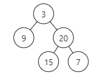

# 이진 트리의 최대 깊이  
https://leetcode.com/problems/maximum-depth-of-binary-tree

문제 : 이진트리의 최대 깊이(depth) 구하라.

입력 : [3,9,20,null,null,15,7]  
출력 : 3  


### 특징
- 반복구조 bfs => 큐 사용
- 입력이 배열같이 보이지만 트리 노드로 주어진 것 확인

### 풀이
- 맨 처음 루트 큐에 넣고 시작
- 큐 안에 있는 것 하나씩 빼며 양쪽 값 추가한다.
- 다 비어 있을 때까지 반복

#### 주의 1
for(int i=0; i< q.size(); i++) 했더니 안되었다.  
이유는 이렇게 하면 매번 q.size()를 갱신해버리기 때문에...    
작은 차이가 큰 차이를 만들어 버린 것인가  

#### 주의 2
temp, 왼쪽, 오른쪽 null 체크하는 부분도 마찬가지  
체크하지 않으면 NullPointerException 발생할 수 있음  
java.lang.NullPointerException: Cannot read field "right" because "<local6>" is null  

```
import java.util.*;
/**
 * Definition for a binary tree node.
 * public class TreeNode {
 *     int val;
 *     TreeNode left;
 *     TreeNode right;
 *     TreeNode() {}
 *     TreeNode(int val) { this.val = val; }
 *     TreeNode(int val, TreeNode left, TreeNode right) {
 *         this.val = val;
 *         this.left = left;
 *         this.right = right;
 *     }
 * }
 */
class Solution {
    public int maxDepth(TreeNode root) {
        
        if(root == null) {
            return 0;
        }
        
        Queue<TreeNode> q = new LinkedList<>();
        q.add(root);
        int result = 0;
        while(!q.isEmpty()) {
            result++;
            int s = q.size(); // 주의1
            for(int i=0; i<s; i++) { 
                TreeNode temp = q.poll();
                if(temp != null) { // 주의2
                    if(temp.right != null) { // 주의2
                        q.add(temp.right);
                    }
                   if(temp.left != null) { // 주의2
                        q.add(temp.left);
                   }
                }
            }
        }
        
        return result;
    }
}
```