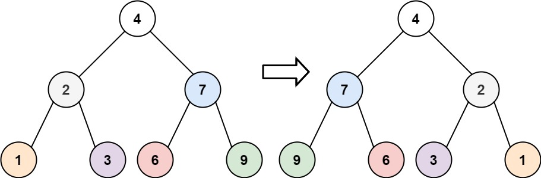

# 이진 트리의 반전
https://leetcode.com/problems/invert-binary-tree/

문제 : 이진트리를 반전시켜라 
부모노드를 기준으로 모든 자식 노드가 좌우 반전됐다. 

#### 예시 1
  

입력: root = [4,2,7,1,3,6,9]  
 출력: [4,7,2,9,6,3,1]  

### 풀이
- 자식 값만 바꾸면 안되고 참조를 바꾸어야 한다.
- DFS로 돌면서 좌우 참조를 반전한다.
- 왼쪽 또는 오른쪽 한쪽이 null인경우 null을 셋팅해주어야 한다.

```
/**
 * Definition for a binary tree node.
 * public class TreeNode {
 *     int val;
 *     TreeNode left;
 *     TreeNode right;
 *     TreeNode() {}
 *     TreeNode(int val) { this.val = val; }
 *     TreeNode(int val, TreeNode left, TreeNode right) {
 *         this.val = val;
 *         this.left = left;
 *         this.right = right;
 *     }
 * }
 */
class Solution {
    public TreeNode invertTree(TreeNode root) {
        if(root == null) {
            return root;
        }
        reverse(root);
        return root;
    }
    public void reverse(TreeNode root) {
        if(root != null) {
            if(root.right != null && root.right != null) {
                // 값만 바꾸는 것이 아니라 자식 참조까지 바꿔야 함
                TreeNode tempNode = root.right;
                root.right = root.left;
                root.left = tempNode;
            }else if(root.right == null) { // 오른쪽이 null인 경우
                root.right = root.left;
                root.left = null;
            } else { // 오른쪽이 null인 경우
                root.left = root.right;
                root.right = null;
            }
            reverse(root.right);
            reverse(root.left);
        }
    }
}
```