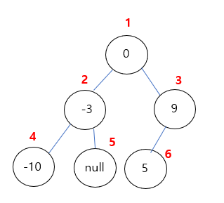

https://leetcode.com/problems/convert-sorted-array-to-binary-search-tree

문제 : 정렬된 배열을 받아 높이 균형 이진 탐색 트리로 변환하라.
높이균형이란 모든 노드의 두 서브 트리간 깊이 차이가 1이하인 것을 말한다.

#### 입출력1
입력 : nums = [-10,-3,0,5,9]  
출력: [0,-3,9,-10,null,5]   
Explanation: [0,-10,5,null,-3,null,9] is also accepted:  


#### 입출력2
입력 : nums = [1,3]  
출력: [3,1]  
Explanation: [1,null,3] and [3,1] are both height-balanced BSTs.  
 

### 풀이
- 이진검색 결과로 트리 구성
- 중간인덱스 값은 트리의 값이 되고, 시작과 끝 인덱스 점을 가지고 계속 반복한다.  

```
class Solution {
    public TreeNode sortedArrayToBST(int[] nums) {
        if(nums.length == 0) { // 예외처리
            return null;
        }
        return construct(nums, 0, nums.length-1); // nums, 시작인덱스, 끝인덱스
    }
    public TreeNode construct(int[] nums, int s, int e) {
        if(e < s) {
            return null;
        }
        int mid = s + (e - s) / 2;
        TreeNode tree = new TreeNode(nums[mid]); // value
        tree.left = construct(nums, s, mid-1);
        tree.right = construct(nums, mid+1, e);

        return tree;
    }
}
```

참고문헌 : 102가지 알고리즘 문제 풀이로 완성하는 코딩테스트 자바 알고리즘 인터뷰 550p