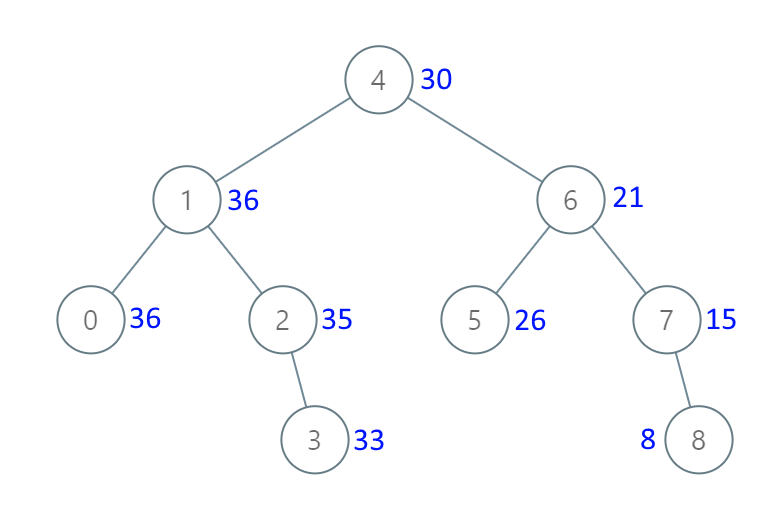

https://leetcode.com/problems/convert-sorted-array-to-binary-search-tree

문제 : BFS의 각 노드를 자신과 자신보다 더 큰 값을 가진 모든 노드의 합으로 만들어라

#### 입출력1
입력 : root = [4,1,6,0,2,5,7,null,null,null,3,null,null,null,8]  
출력 : [30,36,21,36,35,26,15,null,null,null,33,null,null,null,8]  
  
오른쪽에서 부터 더해서 누적해서 왼쪽으로 간다.  
(이미지 출처:  리트코드)  

#### 입출력2
입력 : root = [0,null,1]  
출력 : [1,null,1]
 

```
class Solution {
    int sum = 0;
    public TreeNode bstToGst(TreeNode root) {
        if(root == null) {
            return null;
        }
        return calc(root);
    }
    public TreeNode calc(TreeNode tree) {
        // 오른쪽 끝으로 가기
        if(tree != null) {
            // 오른쪽 부터 탐색
            calc(tree.right); 
            
            // 값 갱신
            sum += tree.val; 
            tree.val = sum;
            System.out.println("1 "+tree.val);
            
            // 왼쪽 탐색
            calc(tree.left);
        } 
        return tree;
       

    }
}
```
### 풀이
입출력 1의 사진을 보면 이해가 간다.  
1) 오른쪽 끝으로 가서 시작
2) 오른쪽 부터 값을 갱신한다.
3) 왼쪽도 똑같이 오른쪽 부터 탐색하게 하면서 처리한다.  


참고문헌 : 102가지 알고리즘 문제 풀이로 완성하는 코딩테스트 자바 알고리즘 인터뷰 553p